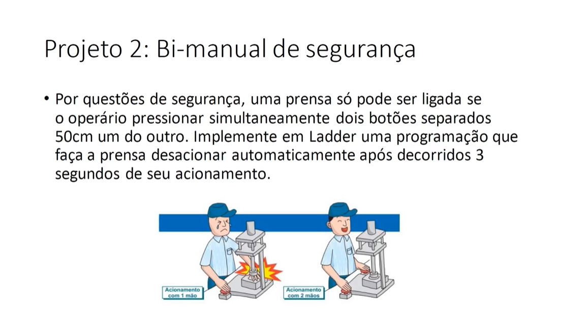
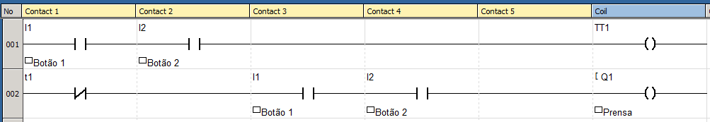
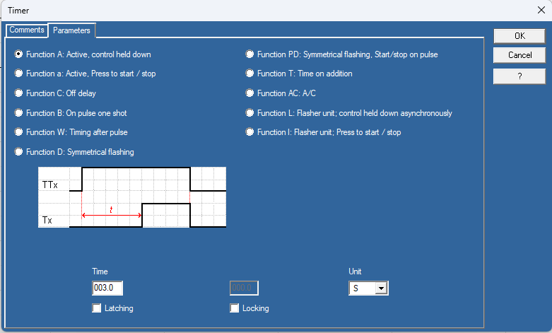

# 
  Safety-Bimanual 

## Goal

This is a safety bimanual project that I have created as one of the projects required in the course [Treinamento em Lógica Ladder para CLP/PLC](https://www.udemy.com/course/treinamento-em-logica-ladder-para-plc/)

## Requirements 

The requirements to this project are described in the image bellow. 

## Implementation 

The program was created using ZelioSoft2 software, which is one of the software created by Schneider Electrics for Ladder programming on their Zelio series PLCs.

The ladder program is show bellow

The Timer TT1 configuration is shown bellow

## Notes and Concepts Learned  

Through this project I could exercise how to implement and AND logic and how to use the Timer Active Control Held Down with the inversion applied on its auxiliary contact. 

I could also notice that the entries such as I1 and I2 in the program are just a representative state of the phsycal entries in the CLP. That the reason we ca use the representative state of the entries in different places of the program. 